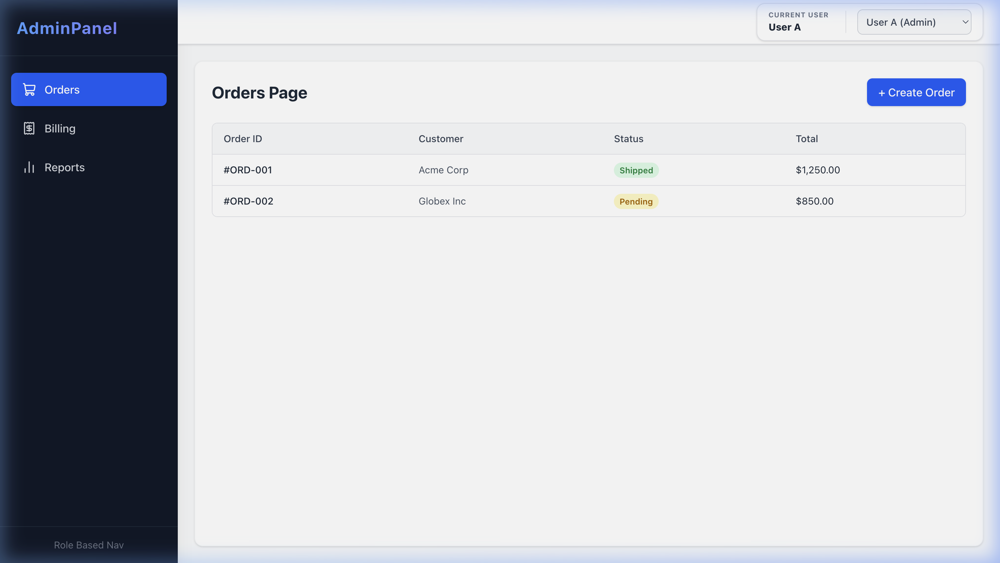

# Role-Based Navigation System



🔗 **[Live Demo](https://role-based-navigation-monodip.vercel.app/)**

This project is a frontend assignment demonstrating a **dynamic, permission-driven UI**. It showcases how to securely and reactively manage user access at both the route level (hiding entire pages/sidebar items) and the action level (hiding specific buttons like "Create" or "Delete").

## Overview

The application features a modern B2B dashboard aesthetic. It uses a centralized `PermissionContext` to handle authorization logic, ensuring a secure-by-default (default-deny) approach to UI rendering and routing.

### Key Features
- **Dynamic Sidebar:** Navigation links are generated based on the user's `VIEW` permissions. 
- **Graceful Empty State:** A user with zero module permissions (User C) sees a friendly "No modules available" message instead of a broken UI.
- **Route Guards (`ProtectedRoute`):** Prevents unauthorized direct URL navigation by checking the current user's permissions and redirecting to a 403 page if necessary.
- **Action-Level Checks:** Renders buttons (e.g., "Create Order", "Delete Report") *only* if the user has the specific action permission in their module configuration.
- **Responsive Design:** The layout includes a collapsible off-canvas sidebar for mobile screens.
- **Mock User Switcher:** Easily toggle between different user profiles to test authorization logic in real-time.

## Tech Stack
- **React (Vite):** Fast, modern frontend framework.
- **React Router v6:** For routing and route guarding.
- **Tailwind CSS v4:** Utility-first CSS framework for clean, responsive styling.
- **Lucide React:** Beautiful, consistent icons.

## Assumptions & Disclaimers
- **Mock Data:** Permissions are defined in `src/data/mockUsers.js` to simulate an API response.
- **UI-Only Actions:** Action buttons (Create, Delete) demonstrate permission-based visibility only; they do not perform real create/delete operations, as this assignment's scope is authorization logic rather than full CRUD functionality.
- **Client-Side Only:** This project demonstrates client-side UI restrictions. In a real-world application, client-side authorization must *always* be backed by server-side validation (e.g., checking tokens/permissions on API endpoints), as client code can be bypassed.
- **Permissions Shape:** We assume actions are represented as an array of strings like `["VIEW", "CREATE", "DELETE"]`.

## How to Run Locally

1. Clone or download the repository.
2. Install dependencies:
   ```bash
   npm install
   ```
3. Start the development server:
   ```bash
   npm run dev
   ```
4. Open the application in your browser (typically `http://localhost:5173`).

## How to Test

1. **User Switcher:** Use the dropdown in the top right corner to switch between **User A** and **User B**.
2. **Observe the Sidebar:** 
   - **User A** has access to Orders, Billing, and Reports.
   - **User B** only has access to Orders. The other links disappear.
3. **Observe Action Buttons:**
   - Go to the **Orders** page as User A: The "Create Order" button is visible.
   - Switch to User B: The "Create Order" button disappears (User B lacks the `CREATE` permission).
4. **Test Route Guards:**
   - As **User B**, try manually typing `/billing` or `/reports` into your URL bar.
   - You will be gracefully redirected to the "403 - Not Authorized" page.
5. **Test Empty State Edge Case:**
   - Switch to **User C (No Access)** using the dropdown.
   - The sidebar will cleanly render a "No modules available" placeholder.
   - Because User C has zero module access, any attempt to navigate to a module route (like the default `/orders`) will immediately redirect them to the "403 - Not Authorized" page.
